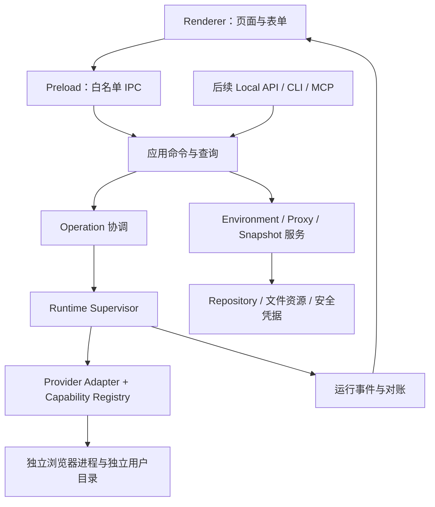

# ContextWeave 项目总体规划与技术方案

**重设计日期：2026-09-23**

**定位：以稳定浏览器环境为核心、本地优先、逐步支持自动化与自托管团队的桌面工作台**

**文档职责：** 产品结构、领域边界、交互、实施顺序和交付标准。技术与库选型见 [technology-stack.md](technology-stack.md)，工程规范见 [AGENTS.md](../AGENTS.md)。

本方案替代此前按大量远期功能展开的路线。当前代码仍处于 v0.1 开发阶段；下面明确标为“目标”的能力尚未实现。本轮只更新设计与规划，不迁移数据库、不替换内核、不改写现有业务实现。当前能力以 [README](../README.md) 与工作区源码为准。

## 1. 重设计结论

ContextWeave 的基本使用闭环是：**创建环境 → 确认身份与网络配置 → 启动 → 使用 → 停止 → 再次打开同一环境 → 必要时恢复数据。**

优先完成三个结果：

1. 用户知道自己打开的是哪个环境，保存了什么配置，实际用了什么内核和代理。
2. 同一个环境在相同内核与配置版本下重启，保持可解释的身份和浏览器数据；异常退出后可以恢复。
3. 界面、批量操作以及未来 API/MCP 使用同一套业务命令、锁和错误规则。

保留 Electron、TypeScript、React、shadcn/Base UI、SQLite 及独立浏览器进程的基础。保留已确认的 New API 风格主题 Drawer、shadcn-admin 风格表格、独立环境配置页和代理 Dialog。重做领域模型、实际能力验证、运行协调、数据生命周期与版本交付顺序。

个人稳定版不再等待团队、工作流和 AI 全部完成。团队、自托管、网站测试、数据处理、业务连接器和 AI/RAG 仍属于产品愿景，按验证后的基础逐步加入。

## 2. GitHub 调研与采用边界

### 2.1 核查方式

本轮通过 GitHub 仓库搜索及作者仓库，核查 15 个项目的默认分支、提交、README、许可文件和目录；对其中 10 个项目定向阅读了环境、指纹、运行、同步或命令入口。附录记录提交快照，避免把持续变化的默认分支当作固定依据。

核查属于静态源码和文档审查，没有运行这些项目的第三方浏览器二进制。表内的功能是仓库文档或所读源码呈现的设计，不能据此认定其发布包、安全性或所有平台均已通过 ContextWeave 验证。搜索结果中的 SDK、资源清单、下载页、停止维护项目和商业软件 API 包未作为完整产品选型。

### 2.2 管理产品与运行服务

| 项目                                                                              | 观察到的设计                                                                   | 许可与采用结论                                                                                                                                                           |
| --------------------------------------------------------------------------------- | ------------------------------------------------------------------------------ | ------------------------------------------------------------------------------------------------------------------------------------------------------------------------ |
| [Ant Browser](https://github.com/black-ant/Ant-Browser)                           | 环境、代理、内核、备份，以及按内核版本报告启动参数是否生效                     | 核查的整个文件树未找到 LICENSE/COPYING。作为公开源码设计参考，不默认复制其代码                                                                                           |
| [Simprint](https://github.com/Simprint/simprint)                                  | 独立环境配置、指纹解析、内核运行桥接；页面和服务按插件组织                     | AGPL-3.0。参考领域拆分与配置流程，不直接引入其插件体系                                                                                                                   |
| [Donut Browser](https://github.com/zhom/donutbrowser)                             | 配置分组、导入、回收站、同步预检；一致性检查区分不一致和未验证                 | 应用 AGPL-3.0；当前 README 指向 Wayfern 内核，内核条款独立核验。参考数据生命周期和预检结果表达                                                                           |
| [MultiZen](https://github.com/multizenteam/multizen-browser)                      | Electron/TS 管理端，ProfileManager、CDP Driver、MCP 分包，人工与自动化共用环境 | 管理端 MIT；源码包含 CFT/CloakBrowser 下载路径，不能把应用 MIT 推及内核。参考命令边界和运行控制                                                                          |
| [Camoufox Profile Manager](https://github.com/polyackiy/camoufox-profile-manager) | 保存首次解析后的指纹，重启重用；分组、代理检查、归档与 API                     | 管理端 MIT，Camoufox 内核独立授权。参考稳定配置快照，不直接采用其全部跨机可移植性主张                                                                                    |
| [Fury](https://github.com/furyteamtop/fury-antidetect-browser)                    | 桌面、独立运行代理、浏览器补丁、可选团队服务分层；有指纹表面与数据模型文档     | 应用/agent 为 AGPL-3.0-or-later，内核补丁为 BSD-3-Clause，共享 schema 为 Apache-2.0；按文件范围核验。参考运行所有权、能力验证和团队分层                                  |
| [AliasMode](https://github.com/aliasmode/aliasmode)                               | Local/Cloud 分离、回收站、版本化 Local API/MCP、运行准入检查                   | 应用 Apache-2.0；Firefox 另仓库，Chromium 路线使用第三方内核。参考准入规则和协议生成，不把云客户端等同于完整自托管服务端                                                 |
| [CloakBrowser Manager](https://github.com/CloakHQ/CloakBrowser-Manager)           | Profile、网络/区域配置、浏览器启动、CDP 连接和错误展示                         | GUI 源码 MIT；[二进制许可](https://github.com/CloakHQ/CloakBrowser-Manager/blob/main/BINARY-LICENSE.md)另行规定使用与分发条件。仅作交互/架构参考，不作为默认开源内核依赖 |
| [GeekEZ Browser](https://github.com/EchoHS/GeekezBrowser)                         | Electron 管理端与代理集成方向                                                  | 根许可为 PolyForm Noncommercial 1.0.0。属于有用途限制的源码可见项目，不进入本项目的通用开源代码复用清单                                                                  |

### 2.3 内核和辅助库

| 项目                                                                     | 类别与许可                                                         | 在本方案中的位置                                                                 |
| ------------------------------------------------------------------------ | ------------------------------------------------------------------ | -------------------------------------------------------------------------------- |
| [fingerprint-chromium](https://github.com/adryfish/fingerprint-chromium) | Chromium 补丁项目，BSD-3-Clause；README 提示补丁可能晚于二进制发布 | 第一个有界接入验证对象。每个候选版本仍需核对源码、实际参数、二进制来源和维护情况 |
| [Camoufox](https://github.com/daijro/camoufox)                           | Firefox 补丁浏览器，MPL-2.0                                        | 第二浏览器家族候选；需独立控制协议与用户目录，不能用 Chromium CDP 适配器直接替代 |
| [camoufox-js](https://github.com/apify/camoufox-js)                      | MPL-2.0 的 JS 客户端；仓库标为实验性                               | 后续 Firefox 验证先评估此 TS/JS 接入路径，不因 Camoufox 就要求用户安装 Python    |
| [BrowserForge](https://github.com/daijro/browserforge)                   | Apache-2.0 的指纹生成工具                                          | 参考相关联参数的生成方式，不作为一个完整浏览器产品或内核能力证明                 |
| [Apify Fingerprint Suite](https://github.com/apify/fingerprint-suite)    | Apache-2.0 的生成、头部、注入等工具集合                            | 候选生成器适配边界；生成器和 JS 注入器不等于内核级能力，不默认安装整套           |
| [browser-profiles](https://github.com/aitofy-dev/browser-profiles)       | MIT 的库、CLI、MCP 工具                                            | 参考公共命令注册表、进程所有权和错误协议，不把注入方案视为完整内核替代品         |

### 2.4 本项目采纳的具体原则

- 学习“固定解析结果”，而不只是保存随机种子：生成器、内核或设备库更新也会改变种子的解析结果。
- 能力报告绑定具体内核版本、操作系统、架构和测试范围；未知、未验证、失败、支持分别表达。
- 网络检测结果带时间和来源；检测不到地理信息时显示未知，不随机补一个位置，也不显示检测通过。
- 环境配置同步、完整浏览器数据迁移、多人同时操作属于不同问题，分别设计。
- GUI、CLI、API 和 MCP 复用业务规则，但每个入口有独立的身份、授权范围与输出脱敏。
- 不照搬商业化限制、未验证的检测分数、复杂插件系统或“所有内核功能完全一致”的承诺。

## 3. 当前代码审查：保留与重做

以下结论基于当前工作区（包含尚未提交的实现），不是已发布版本说明。

| 范围         | 当前依据                                                        | 决定                                                                                         |
| ------------ | --------------------------------------------------------------- | -------------------------------------------------------------------------------------------- |
| UI 基础      | `src/features/theme`、共享 DataTable、独立环境编辑页            | 保留；继续统一空态、失败、禁用原因与批量反馈                                                 |
| 环境与凭据   | contracts、repository、独立用户目录、safeStorage、运行锁        | 保留边界，补版本化模型与恢复语义                                                             |
| 指纹 Adapter | `kernel-fingerprint-chromium` 使用 `--cw-*` 占位参数            | 不能当作真实指纹实现；用已验证提供方的真实协议替换，未验证项不显示为已生效                   |
| 能力描述     | 当前为布尔字段，未配置 manifest 也有肯定声明                    | 拆分声明与实测证据，表单按能力与验证范围开放                                                 |
| 内核安装     | `kernel-core/src/installer.ts` 目前把下载内容写成单个可执行文件 | 升级为完整浏览器包安装，覆盖资源目录、`.app`、解压与回滚；当前不能据此宣称通用内核分发已完成 |
| 配置与运行   | 环境 status 含创建、就绪、运行、错误、恢复等多种含义            | 分离环境生命周期、运行会话和操作任务；页面状态由权威运行服务投影                             |
| 进程协调     | `electron/main.ts` 集中 IPC、目录、凭据、启动和 Worker 协调     | 逐步抽为应用服务与 Runtime Supervisor，Main 保留装配和窗口职责                               |
| 数据读取     | AppDataProvider 聚合多个领域并周期性整体刷新                    | 按领域查询与事件失效；运行事件更新列表，定期对账作为补偿                                     |
| 删除         | 当前删除记录、保留数据目录                                      | 改为可恢复回收站与独立清理操作；遗留目录先扫描归属，不自动删除                               |
| 运行记录     | 已有 runtime_sessions，但缺完整结束时间、阶段与结构化失败       | 增补会话时间线、操作结果、关联诊断和可执行恢复入口                                           |
| 功能入口     | “指纹能力”独立占据全局导航                                      | 指纹编辑归环境，能力说明归内核，复用配置归模板                                               |

## 4. 产品结构与页面设计

### 4.1 导航

目标导航按使用任务组织；功能达到验收条件才出现入口，不预先展示不可用页面。

```text
工作空间切换（保留 TeamSwitcher，团队数据仍可为空）
├── 环境                 默认首页、列表、独立配置页、环境详情
├── 代理                 连接资源、引用情况、检测结果
├── 浏览器资源           内核；后续加入扩展和配置模板的页内分区
├── 运行记录             浏览器会话、批量操作、诊断结果
└── 系统设置             数据存储、备份策略、运行与连接设置

右上角：页面搜索 / 界面语言 / 主题 Drawer / 用户菜单
用户菜单：本地工作空间信息、系统设置、关于等实际可用操作
```

迁移时，“内核”可先保留现有名称，在资源分区落地后改为“浏览器资源”；旧地址保留跳转。“指纹能力”页面迁入内核详情/比较视图，不丢失已有说明。自动化、团队成员、审计等入口随各自阶段加入。

系统设置保持页内左右结构，全局菜单不展开其子菜单。当前只有本地存储时，窄窗口直接显示内容；未来多个分区再增加移动端分区切换。外观与界面语言仅在右上角提供。

### 4.2 环境列表

继续使用已确认的 shadcn-admin 表格模式：不显示页首标题/描述，不添加刷新按钮。

```text
[搜索名称或 ID…] [状态 ▾] [分组 ▾] [代理 ▾] [更多筛选]    [列设置] [+ 新建环境]

[选择] 环境名称       运行状态      代理       浏览器/内核       最近使用      操作
       项目与标签     已停止        美国入口    Chromium · 固定版本           启动 ⋯
       环境 ID        运行中        直连        Chromium · 本机版本           停止 ⋯

选中后：适用数量 + 启动/停止/移动分组/回收站等当前可执行操作
                           已选 … / 共 …  每页 [20 ▾]  ‹ 1 2 3 … n ›
```

- “分组、更多筛选、最近使用”等新增字段随数据模型交付，不先做假控件；现有状态/内核/代理筛选可直接保留。
- 名称为详情入口；ID、标签与配置问题以次级信息展示。高级指纹参数不挤进主表。
- 表头支持升序、降序、清除排序、隐藏；筛选使用 Popover + Command 多选；列设置的勾选态不额外铺背景色。
- 页码提供首尾与相邻页、必要省略号及跳页入口，避免数千页同时渲染；分页控件靠右。
- 默认操作由运行状态决定。停止、重试、恢复不能都显示为同一个“启动”。
- 跨页选择必须明确范围；隐藏于当前筛选之外的记录不执行。提交前冻结目标 ID，执行中筛选变化不改变任务目标。
- 批量操作进入后台操作记录，展示逐项结果；取消只停止尚未开始或支持取消的工作，不承诺回滚已完成项。
- 后续保存视图保存筛选、排序和列配置，不保存行选择或隐含的操作授权。

### 4.3 新建与编辑环境：独立配置页

采用同一套表单组件，不做新建、编辑、详情三套互相漂移的字段逻辑。

```text
[返回环境] 环境名称 / 新建环境                    未保存或只读状态

基本信息      | 当前分区表单                     | 配置摘要（宽屏）
浏览器身份    |                                  | 内核与验证状态
网络与区域    |                                  | 代理与检测时间
浏览器数据    |                                  | 需要处理的问题
启动与权限    |

                                    [取消] [保存] [保存并启动]
```

- 页内分区是可直接导航的配置结构，不强制按向导反复“下一步”。窄窗口摘要折叠到表单内。
- 基本信息：名称、分组、标签、备注。分组用于归档，标签用于多维筛选；首版不建设任意层级目录树。
- 浏览器身份：内核及版本、原生/固定指纹模式、已支持的参数、验证范围。以“配置方案＋高级字段”渐进展开。
- 网络与区域：直连或代理绑定、检测结果、语言/时区/位置。提供显式“从代理填充”动作，保存解析结果；检测失败不伪造地理数据。
- 浏览器数据：持久化目录状态、扩展、导入、快照等实际已交付能力。目录由应用管理，不暴露任意路径输入。
- 启动与权限：初始页面、窗口、下载和站点权限等受支持设置。屏幕指纹与窗口尺寸分开表达，不将二者视为同一个字段。
- 运行时只读；需要重启和需要新目录的改动明确提示。保存校验、启动预检分别进行，保存成功不等于能够启动。
- 内核家族不能在原用户目录上直接切换；改用新环境/受控迁移。内核升级先检查数据兼容性。
- “保存并启动”先生成配置版本，再启动该版本；启动失败保留已保存配置，显示失败阶段和修复入口。
- 离开未保存表单要确认，刷新/返回恢复草稿；敏感代理密码不写入普通草稿存储。

### 4.4 环境详情与常用动作

详情按“概览、配置、运行历史、数据与恢复”组织，用真实信息回答实际运行用了什么配置。

| 动作         | 明确语义                                                              |
| ------------ | --------------------------------------------------------------------- |
| 复制配置     | 新环境 ID、新用户目录；固定指纹模式默认新身份，不复制 Cookie 和登录态 |
| 从快照恢复   | 明确选择快照，检查内核/平台兼容性；替换前停止并保留恢复点             |
| 重新生成指纹 | 仅修改草稿或停止的环境，产生新版本并提示对既有会话一致性的影响        |
| 移入回收站   | 保留配置与用户数据，阻止普通启动；有引用/运行锁时拒绝                 |
| 永久清理     | 单独列出将删除的配置、数据与快照，逐项执行并保留结果                  |
| 导出配置     | 默认不含凭据、Cookie、浏览器数据；完整归档是另一个显式操作            |

### 4.5 代理、浏览器资源、运行记录

**代理：** 保留 Dialog 编辑。增加别名、使用数量、检测状态/时间、出口信息、批量导入预览和逐行错误。支持协议由运行适配器声明；当前认证 SOCKS5 不支持的事实继续明确展示。代理编辑会使旧检测失效。连通性通过不等于 DNS、WebRTC 等所有流量都已覆盖。代理失败不自动降级直连。

**浏览器资源：** 内核列表展示安装版本、固定来源、平台、许可入口、能力验证结果和被哪些环境使用。检查更新与升级现有环境是不同动作；正在运行的版本不被覆盖。扩展和模板后续作为页内分区。模板是复制时的快照，修改模板不自动更改已有环境。

**运行记录：** 浏览器会话与后台操作用页内分区区分。记录开始/结束时间、使用的配置版本、失败阶段、退出原因及恢复动作。常规界面不暴露 PID、原始 CDP 端口、代理密码或完整启动参数。内核、能力比较、运行记录列表继续不显示冗余页首标题和说明。

### 4.6 视觉、组件与主题约束

- 保留 shadcn-admin 的留白与连续表单布局；列表不额外套大卡片，弹窗与表单用 shadcn 组件组合。
- 大表单使用独立页，小资源编辑使用 Dialog；主题仍使用真正的 Drawer。
- 主题的模式、强调色、字体、圆角、密度、侧栏、布局、内容宽度、方向、缩放和减少动画全部保留。
- 模式为系统/浅色/深色。六个快捷色与 HEX 自定义色只影响强调色，中性表面与成功/警告/错误语义色独立。
- 模式、侧栏、布局、方向保留原创 SVG 预览；字体、圆角、密度和宽度使用对应 CSS 预览，避免退回纯文本选项。
- 字体 Auto/Sans/Serif；Auto 使用本地 Public Sans。各 Aa 预览使用对应字体。代码继续使用等宽字体。
- 圆角 Auto/0/0.3/0.5/0.75/1 rem，Auto 基础值 0.625 rem；取色器跟随圆角。
- 密度紧凑/标准/舒适/宽松，默认标准。常规控件 32/36/40/44px，小控件 28/32/36/40px；分别调整菜单、表单与容器，不整体缩放 Tailwind spacing。
- 内容默认全宽；居中最大 64 rem（100% 时 1024px），相对侧栏之外的主区域左右等距，窄窗口填满可用宽度。
- Sidebar 形态和展开模式独立；保留 RTL、90/100/110/125% 缩放、减少动态效果。方向变化不反转技术标识。
- ThemeConfig v2、旧配置迁移、即时预览、串行持久化、失败重试、重置逻辑继续有效；重新设计不重置用户偏好。
- 主题后续增强独立于产品版本推进：先完善可访问性/颜色编辑，再按需求加入导入导出。New API 仅为自主实现的交互与视觉参考，shadcn-admin 的 MIT 声明保留。

## 5. 领域模型

### 5.1 权威数据与职责

| 对象                | 负责什么                                                    | 不负责什么                                 |
| ------------------- | ----------------------------------------------------------- | ------------------------------------------ |
| Environment         | 名称、组织信息、生命周期、当前配置修订号、目录身份          | 不用一个字段承载所有任务与同步状态         |
| EnvironmentRevision | 不可变的身份、网络、浏览器数据和启动配置快照                | 不记录正在运行的 PID，不保存明文密码       |
| FingerprintSpec     | 修订中的值对象：模式、种子、解析后的参数、生成器/提供方版本 | 首期不建设独立的“指纹账户库”               |
| Proxy               | 连接信息、凭据引用、检测结果及时间                          | 不宣称一个成功 ping 代表全部浏览器流量安全 |
| KernelInstallation  | 提供方、内核家族、确切版本、平台、文件清单、校验和          | 不用 `latest` 表示环境已经绑定的版本       |
| CapabilityReport    | 声明能力、已验证能力、覆盖范围和测试证据                    | 未检测结果不能当成支持                     |
| RuntimeSession      | 一次运行的实际修订、内核、进程身份、开始/结束时间、退出原因 | 不反向悄悄修改用户保存的指纹               |
| Operation           | 启动、批量、安装、备份等命令的目标、阶段、进度、结果        | 不依赖发起页面一直存在                     |
| Snapshot            | 归档内容清单、配置修订、兼容性信息、摘要与恢复结果          | 不保证跨 OS/内核的登录态无损复制           |

分组/标签可以先是环境元数据。未来 Workspace、Membership、AccessGrant、Lease、Audit 属于团队边界，团队阶段再增加 schema 与服务；当前 TeamSwitcher 保留接口，不提前引入空团队后端。

### 5.2 三条独立状态轴

```text
环境生命周期：active → archived / trashed → restored / purged
运行会话：idle → starting → running → stopping → ended
                         ↘ failed / recovering
后台操作：queued → running → succeeded / partially-failed / failed / cancelled
```

列表的“已停止”由没有活动会话推导；“配置不兼容”是预检结果，不伪装成浏览器崩溃。恢复锁、代理离线、同步冲突分别提供原因。状态转移由服务执行，不能由 UI 根据点击结果自行认定。

## 6. 指纹与内核策略

### 6.1 首个提供方验证

首个技术验证对象仍为 `fingerprint-chromium`，原因是现有 Chromium/CDP 接入路径可以复用。它只是验证顺序，不是已批准采用其任意 Release。

验证必须提供：确切版本与源码对应关系、真实支持参数、完整安装包、许可材料、维护来源、Windows/macOS 平台结果，以及同一环境多次启动的实测记录。若源码/发布包无法对应、安全维护不足或关键能力不满足，停止该候选的发布接入，不以旧内核或占位参数填补。

Fury Core 作为 Chromium 替代候选，需要单独验证其配置传递协议、补丁构建和 TS 运行时接入成本。Camoufox 作为第二家族候选，在单一生产提供方闭环稳定后验证。生产 UI 只展示该版本实际可交付的提供方，Adapter 接口可扩展不等于已支持多内核。

标准 Chromium/本机 Chrome/Edge 保留为原生隔离环境与回归基线；界面明确其能力，不将普通浏览器启动包装成已具备内核级指纹修改。

### 6.2 稳定身份与一致性

- 默认新建生成一次身份，保存 **seed + resolved spec + generator version + provider version + config revision**。同一版本重启复用解析结果。
- 显式区分原生模式、固定指纹模式。高级修改只开放提供方实际支持的字段。
- UA/UA-CH、平台/GPU/字体、屏幕/DPR、CPU/内存和区域参数分组校验。合理组合不是“所有参数越随机越好”。
- 代理更换提供区域变更建议，由用户确认后产生修订。启动检查只报告问题，不静默重写已保存指纹。
- 浏览器安全升级可能改变 UA、实现细节及数据格式；升级前提供影响说明和恢复点，不承诺跨版本指纹字节级不变。
- 测试至少覆盖主页面、跨源 iframe、Worker 和新标签页。不能用只检查首页的脚本给出全浏览器支持结论。
- 不显示“100% 隐身”“永久防关联”或用单个检测站得分代替功能验证；诊断报告展示具体观察值与范围。

## 7. 运行架构与命令闭环



Runtime Supervisor 首期是 Main 内职责明确的模块，不立即建设后台常驻系统服务。窗口关闭、应用退出、浏览器关闭分别定义：界面隐藏可保留运行；明确退出应用时协调停止并报告未完成操作。只有提出“应用退出后仍运行”的正式需求时，才把运行所有权迁往独立守护进程。

### 7.1 启动流程

1. 校验调用方、环境版本与运行权限；同一环境启动请求幂等归并。
2. 取得环境运行锁并验证进程所有权，确认没有备份/恢复/删除写入冲突。
3. 冻结配置修订，解析绑定内核、凭据和网络计划，执行预检。
4. 记录 Operation 和启动阶段，再创建浏览器进程；失败按逆序清理本次创建的资源。
5. 等待协议端点与配置应用完成，核对进程/会话身份，随后才报告 running。
6. 监听浏览器退出及依赖连接失效，写入结果、结束时间，释放锁并触发列表更新。

端口只绑定本机。CDP 原生端口不能靠“随机端口”获得鉴权；未来对外控制入口必须经过受限代理/授权接口，Renderer 不拿到任意控制能力。进程恢复不能仅凭旧 PID 杀进程，需要路径、启动身份与会话证据。

### 7.2 一套业务命令，多种入口

GUI 先通过现有 IPC 调用同一应用服务，后续 Local API/CLI/MCP 做薄适配。命令定义统一输入/输出 schema、错误码、幂等键、资源作用域和是否可取消。通用查询和授权规则可以复用；批量危险操作仍有明确目标和确认信息。

启动、停止、安装分别限制并发，停止和资源回收优先于新增启动；资源不足时先排队或拒绝，不同时创建大量失去响应的进程。具体并发默认值通过目标平台测试确定。

Operation 状态和失败结果持久化。关闭页面、刷新列表或切换工作空间不取消已经提交的任务；取消必须显式发出，支持重试的命令从可恢复阶段继续。

## 8. 数据、迁移与团队边界

### 8.1 本地数据可靠性

- 配置、会话索引和操作元数据进入 SQLite；浏览器目录、下载、快照等作为文件资源。
- 凭据保存在系统安全存储，配置只保存引用；导出默认排除凭据。完整敏感归档需独立的加密和恢复设计。
- 备份前停止并确认浏览器写入结束；数据库使用支持一致性的备份方式，不直接复制运行中的数据库文件集合。
- 文件资源与数据库不能共享一个 SQLite 事务。安装、恢复、删除采用暂存目录、操作日志、原子替换和重启对账，明确崩溃后的补偿步骤。
- 内核升级可能使用户目录不可降级，回退必须恢复升级前快照，不能只换回旧可执行文件。
- 浏览器数据不保证跨操作系统、家族或任意版本可移植；Cookie 的系统加密也是约束。导入先预检，再展示能恢复与不能恢复的内容。

### 8.2 后续团队能力

团队分两步：先成员/角色/项目权限和配置共享，再受控的浏览器数据交接。自托管服务基于 PostgreSQL 与对象存储；浏览器默认仍在成员设备上运行。

数据交接采用 **取得租约 → 校验基础版本 → 拉取兼容快照 → 本地使用 → 停止 → 生成快照 → 条件提交新版本 → 释放租约**。过期租约持有者不能提交覆盖新版本；数据归档不能用逐文件的最后写入胜出合并。

租约与 fencing token 只能控制本系统的许可和提交，不会自动停止断网设备上的浏览器，也不会撤销外部网站的登录态。强制接管必须明确冲突风险；离线编辑形成分支/待处理状态，不悄悄覆盖。

端到端加密需要团队密钥分发、设备加入、恢复与撤销方案，不能只增加“加密上传”复选框。MFA/OIDC、审计、退出成员与设备撤销与团队首个生产版本一起验收。拥有解密数据的旧设备无法被服务端保证远程擦除。

## 9. 技术路线与交付阶段

版本按验收结果推进，不在没有构建、平台或数据迁移证据时按日期承诺发布。历史 alpha 编号不重写。

| 阶段                 | 主要交付                                                                    | 完成标准                                                                                             |
| -------------------- | --------------------------------------------------------------------------- | ---------------------------------------------------------------------------------------------------- |
| v0.1：个人闭环       | 收敛导航、拆分运行职责、正确的能力状态、启动预检、可解释失败和安全删除语义  | 一个原生环境能创建/编辑/启动/停止/重开；重复请求、异常退出、恢复和凭据失败均有验证；不展示假指纹能力 |
| v0.2：指纹与组织     | 一个通过验证的指纹提供方；固定身份、分组/标签、配置复制、模板基础、代理检测 | 多次重启身份稳定，关键上下文一致；不支持字段不静默生效；复制和代理变更语义正确；真实平台矩阵         |
| v0.3：数据与恢复     | 回收站完整恢复、快照、配置/归档导入导出、迁移预检、磁盘与故障恢复           | 在受支持组合下完成备份—删除/故障—恢复演练；中断导入不破坏原数据；不泄漏凭据                          |
| v0.4：本地自动化接口 | 可关闭的 Local API、CLI/MCP、统一命令、操作进度和人工接管                   | 与 GUI 使用同一锁/配置修订；调用者权限可撤销；一项真实自动化任务与人工操作不争用控制权               |
| v1.0：个人稳定版     | 签名/发布与更新策略、兼容矩阵、升级与恢复、可用文档                         | 前述个人闭环通过持续回归；能从支持的旧版本升级；明确受支持平台、维护与数据恢复范围                   |
| v1.1：团队基础       | 自托管服务、成员、设备、角色/项目授权、配置共享和审计                       | 两设备权限/撤销/隔离验证；不声称已经支持完整浏览器数据无损同步                                       |
| v1.2：团队交接       | 租约、版本化快照、加密归档、受控传输、冲突与离线恢复                        | 两设备成功交接；过期提交、网络中断、强制接管和不兼容数据都能正确处置                                 |
| v1.3：工作流与调度   | 先顺序执行和运行历史，再可视化画布、调度、取消/重试与人工介入               | 工作流可暂停、恢复并报告副作用；不因有画布就宣称具备可靠执行器                                       |
| v1.4+：场景与 AI     | 网站功能测试、数据处理、业务连接器、受控 AI 工具和按需 RAG                  | 对具体用户任务证明收益；模型不拥有任意本地权限，不成为基础环境启动的依赖                             |

第二家族内核的研究可并行于后续阶段，但只有独立验收后才对用户开放，不成为个人稳定版的强制门槛。企业功能的版本号可随实际需求更新，阶段依赖关系不静默跳过。

## 10. 从当前实现迁移

### 10.1 下一轮 v0.1 的工作包

| 顺序 | 改动                                                                    | 交付边界                                                                      |
| ---- | ----------------------------------------------------------------------- | ----------------------------------------------------------------------------- |
| A    | 盘点实际能力和启动参数，标记占位 Adapter；实现第一个提供方验证脚本/记录 | 先证明真实行为，再增加指纹字段；本轮文档调研不算通过验证                      |
| B    | 将 Main 的环境、代理、安装、运行协调按职责拆开；保留现有 IPC 兼容入口   | 不同时换框架、数据库驱动或所有目录                                            |
| C    | 引入配置修订、会话实际版本、操作阶段与结束时间；补迁移和恢复逻辑        | 旧环境 ID、用户目录、代理引用保持；旧配置保存原始备份，不能凭空生成已验证指纹 |
| D    | 环境独立页落地分区和预检摘要；能力页迁入内核详情                        | 复用已有表单、筛选、表格、主题与双语字典；当前已支持字段持续可用              |
| E    | 按领域读取和事件失效，拆分 AppDataProvider 的全量刷新                   | 列表导航状态继续保留；后台任务不依赖 React 生命周期                           |
| F    | 统一删除与回收站的第一步、失败反馈和运行日志；执行一次端到端验收        | 已删除记录留下的目录只列为待处理数据，不默认清理                              |

A 的提供方验证允许与不依赖指纹的 B/C 推进；若验证失败，原生环境管理仍继续交付，指纹功能不伪装完成。

### 10.2 数据迁移要求

1. 引入独立的配置 schema 版本和数据库迁移版本；主题 schema 保持现有 v2，不能跟随产品版本重置。
2. 迁移前备份元数据与配置，识别运行环境；迁移时停止冲突写入，不修改正在使用的浏览器目录。
3. 旧状态映射结合会话与运行锁证据，不把旧 `error` 一律解释为浏览器崩溃。
4. 标准 Chromium 环境迁入原生模式；未配置指纹 Adapter 迁为未验证状态，不为旧账号隐式更换身份。
5. 旧路径和代理引用保留；重复执行迁移要幂等，失败有明确回退步骤。
6. 移动路由提供重定向；用户主题、语言、列设置、分页和编辑草稿不因导航重组丢失。

## 11. 验收与发布规则

- **用户闭环：** 创建、保存、启动、关闭、再次打开、编辑、回收、恢复；表单失败后输入不丢失。
- **运行：** 重复启动、手动关闭浏览器、Main/Worker 异常退出、旧锁/PID 复用、代理失败、权限拒绝、下载取消及低磁盘。
- **指纹：** 同版本跨次启动稳定性、UA/UA-CH 和配置一致性、不同执行上下文、内核升级影响。测试用自有/本地页面，不能把绕过第三方风控作为验收。
- **数据：** 停止后快照、截断包/错误哈希、归档路径穿越、超限包、中断恢复、版本不兼容、凭据不可解密。
- **UI：** 键盘、多选与批量范围、暗色、自定义极端强调色、RTL、缩放、窄窗口、全宽/居中；保留此前确认的交互。
- **平台：** 桌面应用能构建、内核有可用包、实际启动/恢复可用是三个独立结果；按 Windows/macOS 的 CPU 架构分别列矩阵，Linux 进入正式支持时再补完整验收。
- **发布：** 先确认 ContextWeave 自身许可证，再审查复用代码与内核发行材料。构建哈希、来源与第三方许可随版本交付；不要把一个上游应用的许可证用于它捆绑的全部二进制。

## 12. 本次方案替换记录

- 保留已形成的 UI 和本地基础，删除同一主题的讨论流水和相互矛盾的旧约定；本文件维护当前决策，历史由 Git 保存。
- 将“多内核、团队、工作流、AI”并列铺开的设计改为可独立验收的产品阶段。
- 将独立“指纹能力”一级菜单改为上下文中的配置与证据；保留用户要求的页面布局、主题类别与右上角入口。
- 将任意配置项、随机 seed 和表面支持标志，升级为带版本的解析配置及实测能力。
- 将简单文件同步改为有兼容性、版本与租约约束的后期数据交接。
- 内核提供方、团队加密密钥管理、ContextWeave 自身许可证和各平台发布状态仍需相应阶段的实证或维护者决定；不以调研结论冒充这些工作已完成。

## 附录 A：调研快照与关键源码

核查日期均为 **2026-09-23**。提交日期采用 GitHub 返回的 UTC 日期；不把提交时间等同于发布、安全维护或测试完成时间。以下均为本轮实际读取的提交，不依赖“最新版本”这一模糊描述。

| 仓库                                                                                                                                        | 默认分支 | 提交                                                                                                                     | 提交日期（UTC） |
| ------------------------------------------------------------------------------------------------------------------------------------------- | -------- | ------------------------------------------------------------------------------------------------------------------------ | --------------- |
| [CloakHQ/CloakBrowser-Manager](https://github.com/CloakHQ/CloakBrowser-Manager/tree/c393d88c66fe2790ed8ea753c095ad48b9498486)               | `main`   | [`c393d88c66fe`](https://github.com/CloakHQ/CloakBrowser-Manager/commit/c393d88c66fe2790ed8ea753c095ad48b9498486)        | 2026-09-10      |
| [EchoHS/GeekezBrowser](https://github.com/EchoHS/GeekezBrowser/tree/f8970bda53f42e58f0f297dcc6d1d1b3bde2e910)                               | `main`   | [`f8970bda53f4`](https://github.com/EchoHS/GeekezBrowser/commit/f8970bda53f42e58f0f297dcc6d1d1b3bde2e910)                | 2026-09-10      |
| [Simprint/simprint](https://github.com/Simprint/simprint/tree/d2dc939bfae8efda8e4e4d791587d7a364ca4dd8)                                     | `main`   | [`d2dc939bfae8`](https://github.com/Simprint/simprint/commit/d2dc939bfae8efda8e4e4d791587d7a364ca4dd8)                   | 2026-08-24      |
| [adryfish/fingerprint-chromium](https://github.com/adryfish/fingerprint-chromium/tree/3f61b0dfa665e883da8824b1450601fc529dd006)             | `main`   | [`3f61b0dfa665`](https://github.com/adryfish/fingerprint-chromium/commit/3f61b0dfa665e883da8824b1450601fc529dd006)       | 2026-06-21      |
| [aitofy-dev/browser-profiles](https://github.com/aitofy-dev/browser-profiles/tree/1e1f00b21e00952e5f58003b4b9b851fbcc26e1f)                 | `main`   | [`1e1f00b21e00`](https://github.com/aitofy-dev/browser-profiles/commit/1e1f00b21e00952e5f58003b4b9b851fbcc26e1f)         | 2026-09-11      |
| [aliasmode/aliasmode](https://github.com/aliasmode/aliasmode/tree/b1874da8317b2d53631a03fed7c4b48831301208)                                 | `main`   | [`b1874da8317b`](https://github.com/aliasmode/aliasmode/commit/b1874da8317b2d53631a03fed7c4b48831301208)                 | 2026-09-23      |
| [apify/camoufox-js](https://github.com/apify/camoufox-js/tree/c62fa2aa97d29b8841d968c2e19a2ecf46513da3)                                     | `master` | [`c62fa2aa97d2`](https://github.com/apify/camoufox-js/commit/c62fa2aa97d29b8841d968c2e19a2ecf46513da3)                   | 2026-09-18      |
| [apify/fingerprint-suite](https://github.com/apify/fingerprint-suite/tree/67866a6196658076a7b61ecbe2c590a2ff3f4057)                         | `master` | [`67866a619665`](https://github.com/apify/fingerprint-suite/commit/67866a6196658076a7b61ecbe2c590a2ff3f4057)             | 2026-09-21      |
| [black-ant/Ant-Browser](https://github.com/black-ant/Ant-Browser/tree/61feab721f71d65301dfa45397cb9e15e28e8fd8)                             | `master` | [`61feab721f71`](https://github.com/black-ant/Ant-Browser/commit/61feab721f71d65301dfa45397cb9e15e28e8fd8)               | 2026-09-20      |
| [daijro/browserforge](https://github.com/daijro/browserforge/tree/a8b798f37460d1dd02aea33f80c83647913a1bbd)                                 | `main`   | [`a8b798f37460`](https://github.com/daijro/browserforge/commit/a8b798f37460d1dd02aea33f80c83647913a1bbd)                 | 2026-08-29      |
| [daijro/camoufox](https://github.com/daijro/camoufox/tree/5e59b70bdd4765a76f2ca50899707ef0622b9368)                                         | `main`   | [`5e59b70bdd47`](https://github.com/daijro/camoufox/commit/5e59b70bdd4765a76f2ca50899707ef0622b9368)                     | 2026-09-21      |
| [furyteamtop/fury-antidetect-browser](https://github.com/furyteamtop/fury-antidetect-browser/tree/66599ffbea300d869f19da0fc72d998c61b5e39d) | `main`   | [`66599ffbea30`](https://github.com/furyteamtop/fury-antidetect-browser/commit/66599ffbea300d869f19da0fc72d998c61b5e39d) | 2026-09-22      |
| [multizenteam/multizen-browser](https://github.com/multizenteam/multizen-browser/tree/38f9cb39707838565d2232551208fd16f4d08e62)             | `master` | [`38f9cb397078`](https://github.com/multizenteam/multizen-browser/commit/38f9cb39707838565d2232551208fd16f4d08e62)       | 2026-09-17      |
| [polyackiy/camoufox-profile-manager](https://github.com/polyackiy/camoufox-profile-manager/tree/f0bf3048887855c86fdaf3492beb757fa4fe7ab5)   | `main`   | [`f0bf30488878`](https://github.com/polyackiy/camoufox-profile-manager/commit/f0bf3048887855c86fdaf3492beb757fa4fe7ab5)  | 2026-09-15      |
| [zhom/donutbrowser](https://github.com/zhom/donutbrowser/tree/bf2e2e0ba7d8ede627f190c0287d4e64b7b5f47d)                                     | `main`   | [`bf2e2e0ba7d8`](https://github.com/zhom/donutbrowser/commit/bf2e2e0ba7d8ede627f190c0287d4e64b7b5f47d)                   | 2026-09-23      |

关键源码/文档入口：

- **black-ant/Ant-Browser**：[backend/app_browser_fingerprint_matrix.go](https://github.com/black-ant/Ant-Browser/blob/61feab721f71d65301dfa45397cb9e15e28e8fd8/backend/app_browser_fingerprint_matrix.go)。
- **Simprint/simprint**：[plugins/pages/create-window/src/utils/resolve-fingerprint-config.ts](https://github.com/Simprint/simprint/blob/d2dc939bfae8efda8e4e4d791587d7a364ca4dd8/plugins/pages/create-window/src/utils/resolve-fingerprint-config.ts)、[src-tauri/src/services/environment/launch_runtime/fingerprint.rs](https://github.com/Simprint/simprint/blob/d2dc939bfae8efda8e4e4d791587d7a364ca4dd8/src-tauri/src/services/environment/launch_runtime/fingerprint.rs)。
- **zhom/donutbrowser**：[src-tauri/src/fingerprint_consistency.rs](https://github.com/zhom/donutbrowser/blob/bf2e2e0ba7d8ede627f190c0287d4e64b7b5f47d/src-tauri/src/fingerprint_consistency.rs)、[src-tauri/src/profile/types.rs](https://github.com/zhom/donutbrowser/blob/bf2e2e0ba7d8ede627f190c0287d4e64b7b5f47d/src-tauri/src/profile/types.rs)、[src-tauri/src/sync/preflight.rs](https://github.com/zhom/donutbrowser/blob/bf2e2e0ba7d8ede627f190c0287d4e64b7b5f47d/src-tauri/src/sync/preflight.rs)。
- **multizenteam/multizen-browser**：[packages/profile-manager/src/ProfileManager.ts](https://github.com/multizenteam/multizen-browser/blob/38f9cb39707838565d2232551208fd16f4d08e62/packages/profile-manager/src/ProfileManager.ts)、[apps/desktop/src/main/ChromiumBootstrap.ts](https://github.com/multizenteam/multizen-browser/blob/38f9cb39707838565d2232551208fd16f4d08e62/apps/desktop/src/main/ChromiumBootstrap.ts)。
- **polyackiy/camoufox-profile-manager**：[src/camoufox_pm/core/fingerprint_store.py](https://github.com/polyackiy/camoufox-profile-manager/blob/f0bf3048887855c86fdaf3492beb757fa4fe7ab5/src/camoufox_pm/core/fingerprint_store.py)。
- **furyteamtop/fury-antidetect-browser**：[docs/01-architecture.md](https://github.com/furyteamtop/fury-antidetect-browser/blob/66599ffbea300d869f19da0fc72d998c61b5e39d/docs/01-architecture.md)、[docs/02-fingerprint-surface.md](https://github.com/furyteamtop/fury-antidetect-browser/blob/66599ffbea300d869f19da0fc72d998c61b5e39d/docs/02-fingerprint-surface.md)。
- **aliasmode/aliasmode**：[lifecycle-admission.ts](https://github.com/aliasmode/aliasmode/blob/b1874da8317b2d53631a03fed7c4b48831301208/lifecycle-admission.ts)、[fingerprint-attestation.ts](https://github.com/aliasmode/aliasmode/blob/b1874da8317b2d53631a03fed7c4b48831301208/fingerprint-attestation.ts)。
- **CloakHQ/CloakBrowser-Manager**：[LICENSE](https://github.com/CloakHQ/CloakBrowser-Manager/blob/c393d88c66fe2790ed8ea753c095ad48b9498486/LICENSE)、[BINARY-LICENSE.md](https://github.com/CloakHQ/CloakBrowser-Manager/blob/c393d88c66fe2790ed8ea753c095ad48b9498486/BINARY-LICENSE.md)、[backend/browser_manager.py](https://github.com/CloakHQ/CloakBrowser-Manager/blob/c393d88c66fe2790ed8ea753c095ad48b9498486/backend/browser_manager.py)。
- **aitofy-dev/browser-profiles**：[docs/adr/0001-command-registry.md](https://github.com/aitofy-dev/browser-profiles/blob/1e1f00b21e00952e5f58003b4b9b851fbcc26e1f/docs/adr/0001-command-registry.md)、[docs/browser-lifecycle.md](https://github.com/aitofy-dev/browser-profiles/blob/1e1f00b21e00952e5f58003b4b9b851fbcc26e1f/docs/browser-lifecycle.md)。
- **apify/camoufox-js**：[src/index.ts](https://github.com/apify/camoufox-js/blob/c62fa2aa97d29b8841d968c2e19a2ecf46513da3/src/index.ts)。

## 附录 B：技术依据

- [Playwright BrowserType](https://playwright.dev/docs/api/class-browsertype)：CDP 连接仅用于 Chromium，与 Playwright 原生连接存在能力差异。
- [Chrome Cookie 的 App-Bound Encryption 说明](https://security.googleblog.com/2024/07/improving-security-of-chrome-cookies-on.html)：浏览器登录态迁移不能仅假设复制目录即可完成。
- [Electron 安全指南](https://www.electronjs.org/docs/latest/tutorial/security)：管理页面与外部浏览器、本地能力之间保持明确边界。
- [Node.js 发布计划](https://github.com/nodejs/Release/blob/main/schedule.json)：运行时支持周期与发布资格独立核验。
